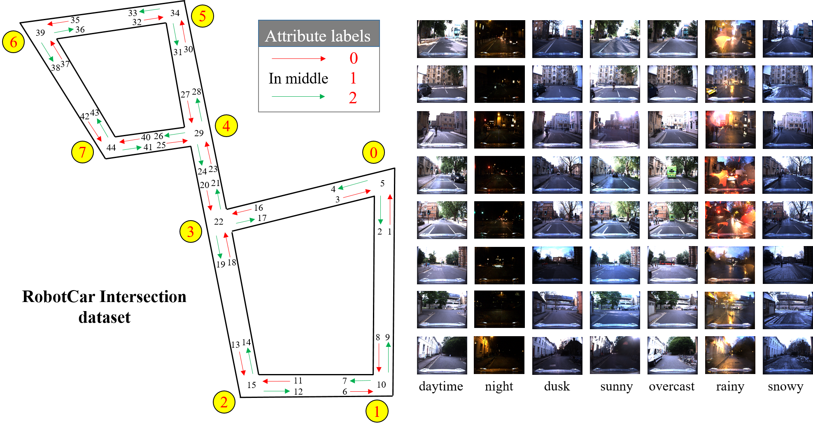

# Road-Intersection-Re-ID

We publish our code and datasets for the paper "Traffic Intersection Re-identification using Monocular Camera Sensor".

# Intersection datasets

## RobotCar Intersection

***The download link will be coming soon in Google Drive.***

Based on the prior work of RobotCar, we present "RobotCar Intersection" which covers 36588 images of eight intersections in different season and different time of the day.

## Campus Intersection

***The download link will be coming soon in Google Drive.***

This dataset consists of 3340 sperical panoramic images from eight intersections in the Jiading campus of Tongji University.

# CODE Requirements:

 *python 3.6
 *PyTorch: Make sure to install the Pytorch version for Python 3.6 with CUDA support (code tested for CUDA 8.0, CUDA 9.0 and CUDA 10.0). I am using PyTorch 0.4.1.
 ***Additional Python packages**: numpy, matplotlib, Pillow, torchvision
# Publications:

If you use our code or dataset, please consider referencing any of the following papers:
Traffic Intersection Re-identification using Monocular Camera Sensor. L. Xiong, Z. Deng, Y. Huang, W. Du, X. Zhao, C. Lu, W. Tian. ***, October 2020.\[***PDF***\]
