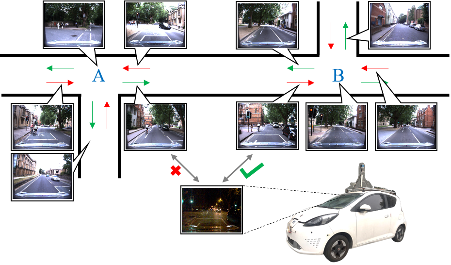
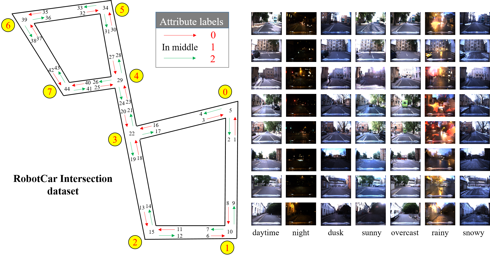
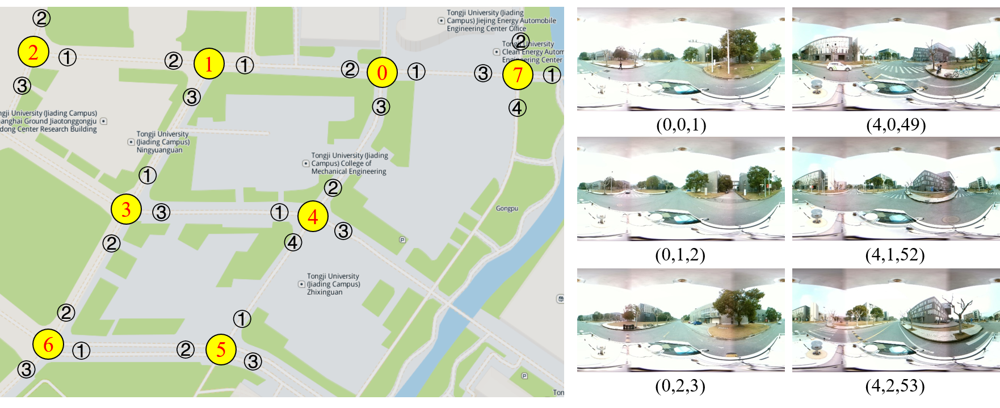
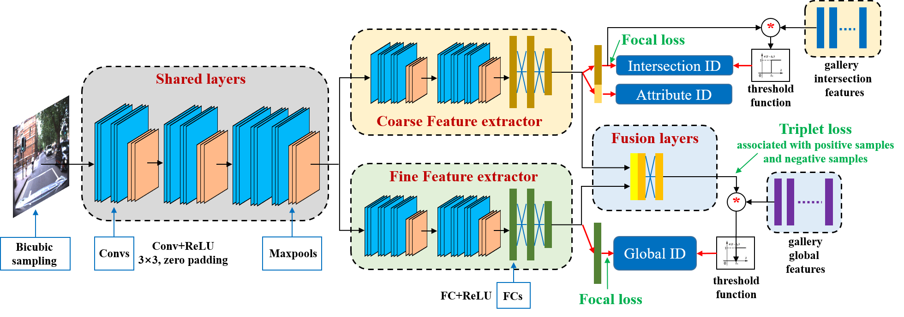

# Road-Intersection-Re-ID

We publish our code and datasets for the paper "Traffic Intersection Re-Identification Using Monocular Camera Sensors".  The code and datasets are coming soon!

## CODE Requirements:

* python 3.6.8

* PyTorch: Make sure to install the Pytorch version for Python 3.6 with CUDA support (code tested for CUDA 8.0, CUDA 9.0 and CUDA 10.0). I am using PyTorch 1.4.0.

* Additional Python packages: numpy, matplotlib, Pillow, torchvision0.5.0

## Publications:

If you use our code or dataset, please consider referencing the following papers:

Xiong, L.; Deng, Z.; Huang, Y.; Du, W.; Zhao, X.; Lu, C.; Tian, W. Traffic Intersection Re-Identification Using Monocular Camera Sensors. *Sensors* **2020**, *20*(22), 6515.**[PDF](https://doi.org/10.3390/s20226515)**

# Traffic Intersection Re-identification using Monocular Camera Sensor

As the hubs of transportation networks, intersection is very valuable for research. To arrive at the destination, drivers usually construct the global driving route and especially preset the behaviors in intersections before moving the vehicle. All intersection images are saved in drivers' brain to form a topological map. Similar to human drivers, we argue that the required information in driving behavior decision for intelligent vehicles (IVs) such as fine intersection attributes and sparse positioning w.r.t. the intersection topological map can be achieved under a rational road intersection re-ID approach.



This project strives to explore intersection re-ID by monocular camera sensor, which strongly affects driving behavior decisions with given routes, yet has long been neglected by researchers. The visual sensor based intersection re-ID task in this project is defined as the multi-task including classification of intersection and its fine attributes, and the determination of global vehicle pose. For this project, we propose a Hybrid Double-Level re-identification approach which exploits two branches of Deep Convolutional Neural Network, and a mixed loss for network training. As no public datasets are available for the intersection re-ID task, we propose two intersection dataset named as "RobotCar Intersection" and "Campus Intersection".

## RobotCar Intersection

***The download link will be coming soon in [Google Drive](https://accounts.google.com/).***

Based on the prior work of RobotCar, we present "RobotCar Intersection" which covers 36588 images of eight intersections in different season and different time of the day.



## Campus Intersection

***The download link will be coming soon in [Google Drive](https://accounts.google.com/).***

This dataset consists of 3340 sperical panoramic images from eight intersections in the Jiading campus of Tongji University.



## HDL Network Architecture

We propose a Hybrid Double-Level (HDL) network for traffic intersection re-identification which is defined as the multi-task including classification of intersection and its fine attributes, and the determination of global vehicle pose.  



We will compare our networks of different configuration with three baseline methods. The training detail and experimental result are shown in the paper.

## Files notes

```
txt file = (image path, intersection ID, Attribute ID, global ID)

data_campus_new.txt # the test images and labels of new 3 intersections.
data_campus_test.txt # the test images and labels of old 5 intersections.
data_campus_train.txt # the train images and labels of old 5 intersections.
data_test_rest40.txt # the test images and labels of RobotCar intersections.
data_train_previous60.txt # the train images and labels of RobotCar intersections.
```

